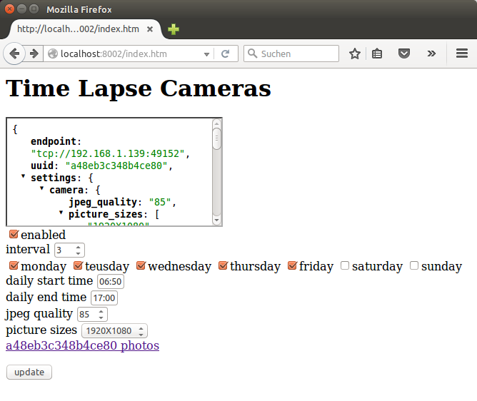

Lapse Controller is two things. First, it is an application that talks to a network of time lapse cameras, downloading imagery from them at regular intervals so they don't fill up. Second, its a front end application that allows you to monitor what time lapse cameras are connected and change their capturing schedule with a simple website like this:

Yes there are tons of secuirty holes here. Look for issues and thoughts on resolving some of them at a future point in time.
